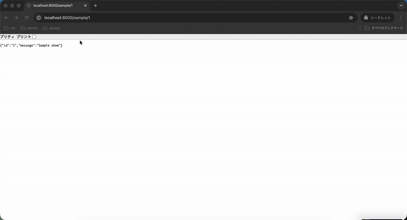

# Laravel Route Jump IntelliJ Plugin

<!-- Plugin description -->
Jump from a Laravel URL to the corresponding Controller@method in PhpStorm or IntelliJ IDEA.

Key capabilities:
- Instant navigation from URLs to controller methods
- Support for both full URLs and path-only formats
- Handles parameterized routes (e.g., /users/{id})
- Works with local PHP and containerized Docker environments
- Integrates seamlessly with PhpStorm's navigation system
- Saves significant development time by eliminating manual route searching
<!-- Plugin description end -->

## Demo

## Features

- 🚀 **Quick Navigation**: Jump directly from URLs to Controller methods
- 🌐 **Full URL Support**: Accepts both full URLs (`http://localhost:8000/users/123`) and paths (`/users/123`)
- 🔧 **Flexible Configuration**: Supports local PHP and Docker environments
- ⚡ **Keyboard Shortcut**: `Ctrl+Shift+J` (or `Cmd+Shift+J` on Mac)
- 📱 **Parameter Routes**: Handles dynamic routes with parameters like `/users/{id}`
- 🎯 **Precise Navigation**: Cursor lands on the method name, not just the function keyword

## Configuration

Before using the plugin, configure the Artisan command:

1. Go to **Settings** > **Tools** > **Laravel Route Jump**
2. Set the appropriate Artisan command for your environment:
   - **Local PHP**: `/path/to/php artisan`
   - **Docker**: `docker compose exec app php artisan`
   - **Custom**: Any command that runs `artisan route:list --json`

## Usage

1. Press `Ctrl+Shift+J` (or `Cmd+Shift+J` on Mac)
2. Enter a Laravel URL in any of these formats:
   - Full URL: `http://localhost:8000/users/123`
   - URL with query params: `http://localhost:8000/users/123?page=2`
   - Path only: `/users/123`
   - Simple path: `users/123`
3. Hit Enter and jump directly to the controller method!

## Requirements

- Laravel project with Artisan CLI
- PHP or Docker environment configured
